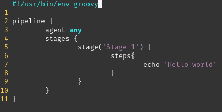
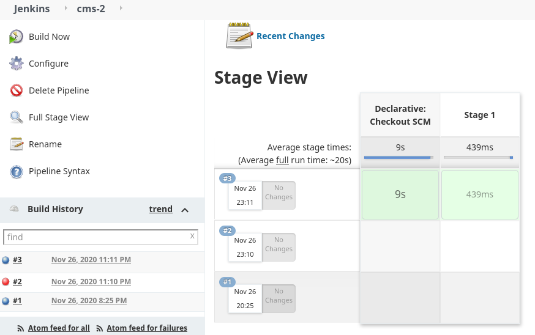

#Missing:
-> Pipeline with a small description is provided

-> Explained 
    -> Unit Tests
    -> Integration Tests
    -> Mutation Tests

-> Tomcat Server (conf., prints automatic test)
-> Manual Test (email print and config)
-> Overall build fails 

# 1. Report [Compenent 4]
@JoãoSantos

## Scripted Jenkins File [Parallel Build]  

### First Test (Hello World)
Testar algumas funcionalidades retiradas das aulas teoricas 

### Pipeline Design

