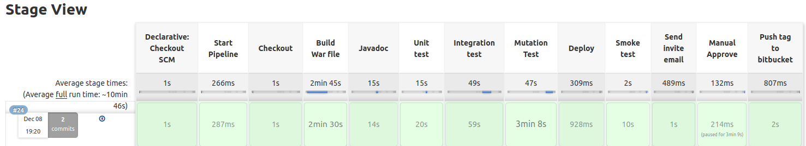

# 1. Report [Compenent 4]
@JoãoSantos

## Scripted Jenkins File [Parallel Build]  

### First Test (Hello World)
Testar algumas funcionalidades retiradas das aulas teoricas. 

### Pipeline Design

Foi usada o paralelismo no Pipeline recorente aos testes 'Units, Integration e Mutation', essa opção de grupo, deveu-se a facto de que o tanto o 'War file' e o 'Javadoc' devem ser executados de forma sequencial. Para o o 'Deploy do Tomcat' e o 'Smoke test' optou-se por ser após paralelismo devido à importancia destes testes passarem antes de verificar que se encontra disponivel através do 'curl' para o 'Manual Approve' através de uma notificação previa via email ('Email notification').

### Stage View

### Start
Esta é a primeira etapa on apenas é apresentada umas variaveis e ambiente do sistema em questão [env.BUILD_ID, env.JENKINS_URL, env.BUILD_NUMBER, env.WORKSPACE].

### Repository Checkout
Nesta etapa é feito um 'checkout' a partir do repositorio remoto do git (bitbucket.org/1160929/odsoft-m1b_g1.git) do 'branch master' com a minha credencial ID.

### War File
Esta etapa é utilizado um gradle task ('gradle clean build -g gradle-user-home'). Também é utilizado o 'archiveArtifacts' parar gerar o 'war file' para um caminho previamente escolhido.

### Javadoc
Nesta, o objectivo é gerar o 'javadoc' da aplicação. Através de uma 'gradle task' este mesmo objectivo é cumprido com sucesso.

### Unit Tests

Nesta etapa, através de um gradle taks ('gradle test -g gradle-user-home') e outro ('gradle jacocoTestReport -g gradle-user-home'), é possivel executar e publicar os testes unitarios implementados anteriormente.

### Integration 

Com semelhança do anterior, este teste é executado em paralelo, visto que não contêm nenhuma dependencia. A task gradle 'integrationTest' é executada e de seguida o 'gradle jacocoIntegrationReport' para publicar o relatorio dos testes.

### Mutation Test 

Este é o ultimo teste executado atraves do paralelismo. Utilizando o uma taks 'gradle pitest -g gradle-user-home'.

### Deploy to TomCat

### Smoke Test

curl --write-out "%{http_code}" --silent --output /dev/null ' + cmsHttp
Este codigo é executado para testar a conexão para ver se o servidor (TomCat) esta 'up' e a correr, para de seguida ser testado manualmente pelo utilizador. 

### Email notification for manual test

### Manual Approve

### FeedBack

