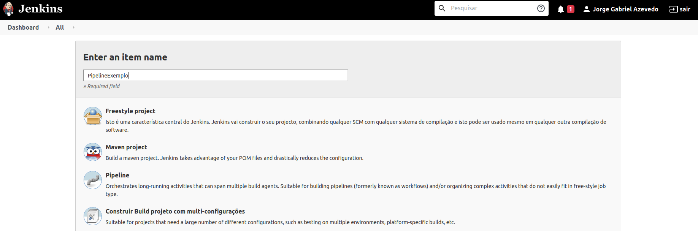
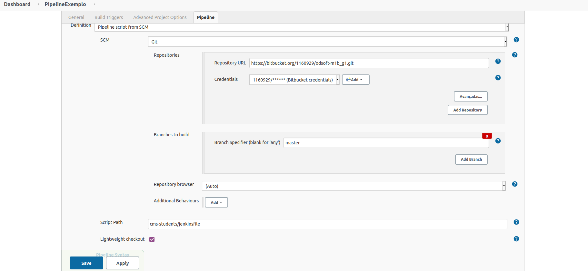
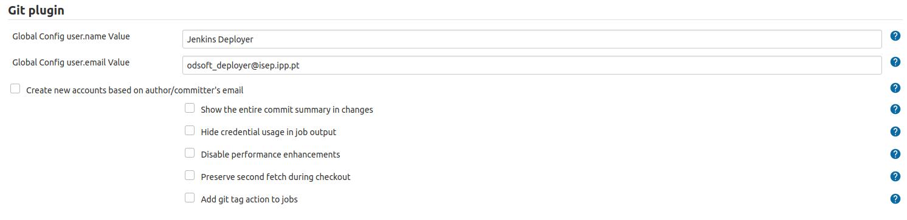
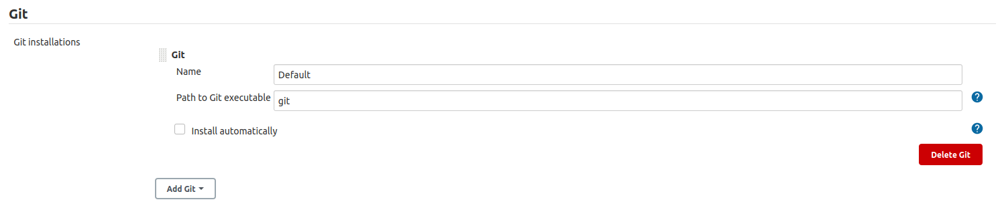
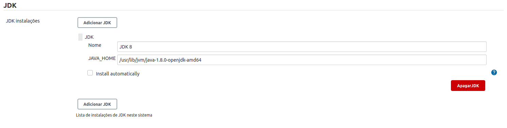
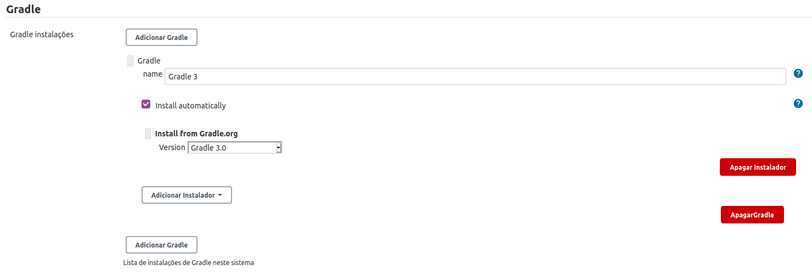
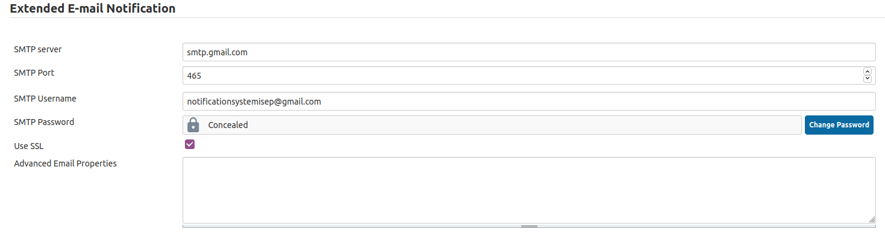

# Configurações
Neste ficheiro estão descritas as configurações das aplicações e serviços utilizados no desenvolvimento do Projeto Final de ODSOFT.

## Portas das aplicações
| Aplicação     | Porta |
|---------------|-------|
| Jenkins       | 8090  |
| Tomcat Local  | 8091  |
| Tomcat Docker | 8080  |
| MySQL Docker  | 3306  |

## Configuração de credenciais do Jenkins
Para configurar o envio de emails do Jenkins, é utilizada uma conta de Gmail

| ID              | Username                         | Password |
|-----------------|----------------------------------|----------|
| bitbucket-creds | (username do bitbucket)          | •••••••• |
| n/a             | notificationsystemisep@gmail.com | •••••••• |

## Plugins do Jenkins
Para a execução deste projeto são necessários os seguintes plugins
- Git

## Jobs do Jenkins
Para a execução deste projeto são necessários os seguintes plugins
- Bitbucket Plugin
- Email Extension
- Git
- JaCoCo
- HTML Publisher
- Pit Mutation Plugin
- Report Info (?)

## Configurar o Jenkins
Para poder executar a pipeline é necessário seguir o seguinte procedimento
1. Na homepage da UI do Jenkins carregar na opção "Novo Item"
1. Dar um nome ao Job e selecionar a opção "Pipeline". De seguida carregar em "OK"

1. Descer até à secção "Pipeline". Na destination selecionar "Pipeline script from SCM"
1. No campo SCM colocar Git
1. No campo Repositories colocar o URL do repositório e nas credencias selecionar a credencial criada.
1. Em Branches to build to build colocar o nome da branch exatamente como ele se escreve.
Seria possível ter um job para as duas branchs mas o grupo optou por ter 2 jobs distintos e daí só se colocar uma única branch.
1. Por fim em Script Path é colocado o caminho desde o *root* do repositório ate ao Jenkins File e carregar em Save.

### GIT
Para configurar o GIT, deve ser feita a seguinte configuração na página **Configurar Sistema** dentro de **Gerir o Jenkins** na secção **GIT**
O valores a ser colocados variam consoante o propósito. O dados apresentados são fictícios

De seguida deve aceder à página **Configuração Global** e na secção **GIT** configurar o acesso ao git na máquina local

### JDK
Para configurar o JDK, deve ser feita a seguinte configuração na página **Configurar Sistema** dentro de **Configuração Global** na secção **JDK**
O valores a ser colocados variam consoante o sistema.

### Gradle
Para configurar o Gradle, deve ser feita a seguinte configuração na página **Configurar Sistema** dentro de **Configuração Global** na secção **Gradle**
O valores a ser colocados variam consoante o sistema.

### Email
Para configurar o envio de email, deve ser feita a seguinte configuração na página **Configurar Sistema** dentro de **Gerir o Jenkins** na secção **Extended E-mail Notification**

| Serviço      | URL                 | Porta | SSL   |
|--------------|---------------------|-------|-------|
| SMTP         | smtp.gmail.com      | 465   | Yes   |

