# Class Assignment - 2

## Objetivos globais do projeto

## Desenho das pipelines

### Pipeline Sequencial
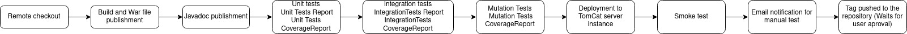

### Pipeline Paralela
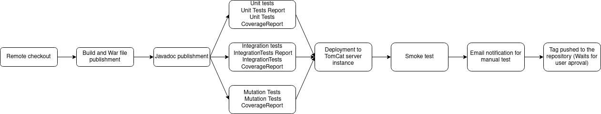

## Implementação das Pipelines
A implementação teve por base a combinação de dois fatores:
 - Pipelines Sequencias VS Pipelines Paralelas
 - Scripted Pipelines VS Pipelines construidas com o plugin Build Pipeline

### Pipeline sequencial utilizando Build Pipeline Plug-In

Este componente teve como objetivo a implementação de uma pipeline sequencial no Jenkins usufruindo de um plugin -Build Pipeline plugin- que permite ver em tempo real a evolução da mesma. Esta pipeline é feita sem recurso a jenkinsfile, pois usa a interface do Jenkins para executar as diferentes tasks.

Nesta pipeline, como já foi mencionado em cima, todos os jobs são executados de maneira sequencial, ou seja, o primeiro job é accionado o Build Now e quando termina com sucesso ele automaticamente começa o job seguinte.

A seguinte imagem mostra a pipeline implementada e executada com sucesso usando o plugin.

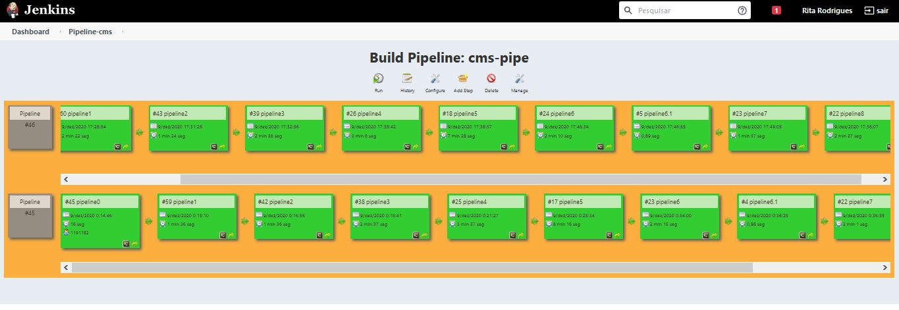

### Pipeline paralela utilizando Build Pipeline Plug-In

Esta parte do Class Assignment teve como objectivo a implementação de uma pipeline no Jenkins utilizando um plug in. Este plug in foi o Build Pipeline, permitindo, sem a utilização de scripts implementar a pipeline pretendida.

Esta tarefa implementou uma alternativa para executar uma pipeline com algumas tasks em paralelo, sendo estas as tasks de Unit, Integration e Mutation tests. Na seguinte imagem está representada a imagem da pipeline implementada e corrida com este plug in.

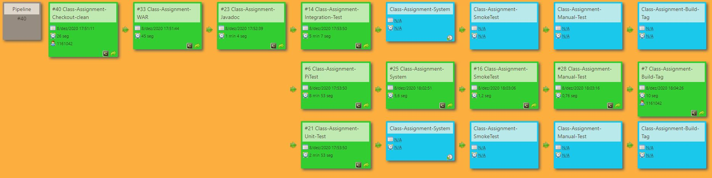

#### **Checkout e clean**

Os projects referentes a esta parte da pipeline são: **Class-Assignment-Checkout-clean** e **pipeline0**.

A pipeline inicia com o checkout da branch do bitbucket onde o código fonte está guardado. Executa de seguida a task clean. 

Após esta execução, e de forma a evitar a reutilização do workspace para evitar futuros problemas devido a commits simultâneos, ou outro tipo de alterações a acontecer no Jenkins/Repositório remoto, é utilizado o Copy artifacts, para poder ser passado o código referente a este checkout ao próximo projeto do jenkins, neste caso o projeto relativo ao War. É de notar que nestes passos iniciais, devido a dependências de todo o código, são copiados todos os ficheiros presentes no repositório remoto.

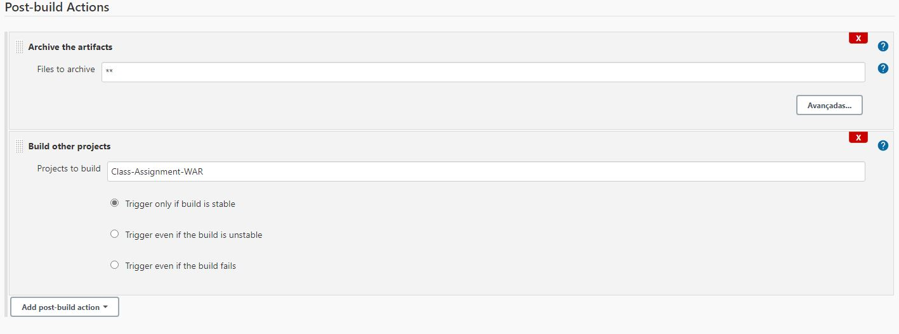

#### **Build e war**

De seguida, é executado outro job da pipeline, que faz o build e gera o ficheiro .war da aplicação. O código utilizado para este ficheiro ser gerado é o provenienete do último job, checkout, e do seu consequente armazenamento do artefactos. 

Os nomes dos jobs referentes a esta parte são: **Class-Assignment-WAR** e **pipeline1**.

Aqui simplesmente é executada a task war do gradle, que gera o ficheiro. De seguida todos os ficheiros são armazenados, também como artefactos, para passar ao próximo passo, a geração do Javadoc.

Nas post-build actions, são armazenados os artefactos.
 
#### **Javadoc**

A geração do javadoc é feita nos Jobs **Class-Assignment-Javadoc** e **pipeline2**.

Ao que se assemelha ao Job *War* este job também utiliza os artefactos (que contêm o código) do ultimo Job.

Depois é feita a geração do Javadoc e a sua consequente publicação. Após isso é definido quais os jobs a serem executados após o build bem sucedido deste job relativo ao **War**. Nesta etapa, para a pipeline em paralelo é utilizado um plug in (Join trigger) que permite fazer a ramificação e utilizar paralelismo para executar os testes (integration, pit mutation e unit). Com isto, o objetivo será optimizar o tempo de execução da pipeline, uma vez que estas tasks são independentes umas das outras são executadas em paralelo, não causando atrasos na execução da pipeline, ao contrário do que poderia acontecer na pipeline sequencial.

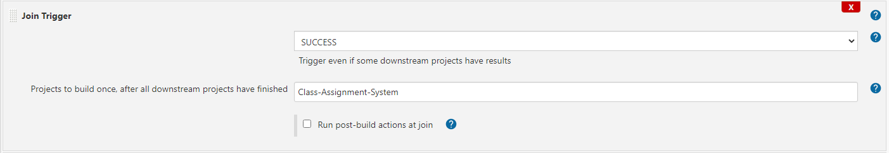

#### **Unit Tests**

A proxima task, a ser executada em paralelo com os integration e mutation tests, são os unit tests, no Job: **Class-Assignment-Unit-Test**. No caso da pipeline sequencial, é apenas esta task a ser realizada, no job: **pipeline3**.

É feita a cópia dos artefactos (todos os aretfactos gerados até ao javadoc) para o workspace relativo aos unit tests.

Estes tests são executados utilizando o comando gradle *test* e são publicados a cobertura e os resultados dos testes utilizando os respectivos plug ins, tanto do jacoco como do html publish report.

Neste caso não será necessário fazer trigger do próximo passo, uma vez que este trigger é feito a partir do plug in *Join Trigger*, configurado no último Job.

#### **Integration tests**

Paralelamente é executada a task integration tests, sendo o seu nome: **Class-Assignment-Integration-Test**.
No caso da pipeline sequencial, esta task tem o nome **pipeline4** e apenas começa quando a anterior termina com sucesso.

De maneira semelhante ao que acontece nos unit tests, é feita a cópia dos artefactos e é executada a task integrationTest.

#### **Mutation tests**

Também em paralelo, é executado o projeto do jenkins chamado **Class-Assignment-PiTest**, que executa os Mutation Tests.
No caso da pipeline sequencial, este passo é feito em e **pipeline5** e apenas começa quando o job anterior termina com sucesso.

É executada a task pitest do gradle, e de seguida são publicados os seus Pit mutation reports através pit mutation plug in, configurada nas post build actions, como mostra a figura em baixo.

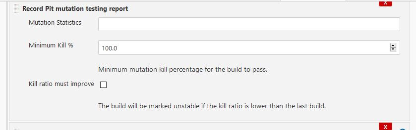

#### Deployment

De seguida, é feito o deployment para uma instancia de servidor do tomcat. Este processo pode ser acompnhado no projeto **Class-Assignment-System** e **pipeline6**.

Inicialmente neste projeto são copiados os artefactos necessários, de momento o único necessário será o ficheiro war, sendo este o unico a ser copiado para o workspace.


De seguida é executada uma post build action que é Deploy war to a container, utilizando o Deploy to container Plugin. A configuração deste deployment utiliza as credenciais necessárias do tomcat para fazer o deployment e a localização da instantância do mesmo. Na seguinte imagem é possível verificar este mesmo passo.

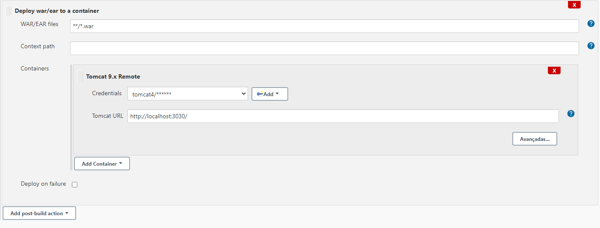

Foi necessário também neste passo fazer uma configuração ao servidor tomcat para possibilitar efetuar o deployment. Foi necessário fazer algumas configurações de utilizadores de modo a serem utilizadas tal como é visto na imagem acima. Estas configurações foram feitas no ficheiro *tomcat-users.xml* presente na pasta *conf* relativa ao tomcat.
Na seguinte imagem é possível verificar a aplicação na lista de aplicações da instância de servidor do Tomcat.

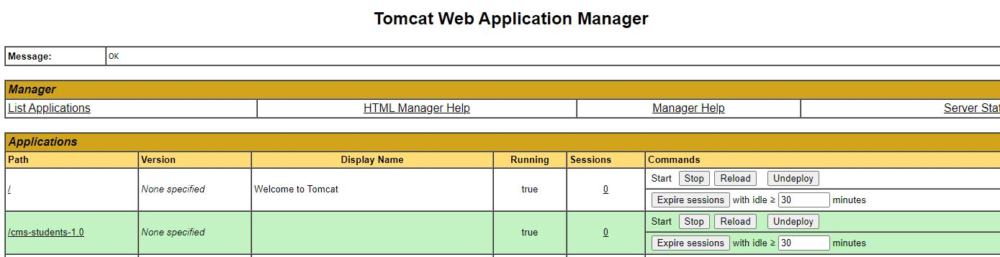

#### Smoke test 

Após o sucesso do projeto anterior, é executado o **Class-Assignment-SmokeTest** e **pipeline6.1**.

Este consiste num simples curl que permite saber o estado do servidor depois do deployment, se este é acessível.

#### Manual test and aproval

Chegando a este job, **Class-Assignment-Manual-Test** e **pipeline7**, significa que todos os passos anteriores foram executados com sucesso.

Então neste ponto é enviado um email para um utilizador a pedir execução de testes para a posterior aceitação.
Nesta configuração, para além do email, é definida que a proxima ação, o envio de uma tag para o repositorio, é feito com uma aprovação do utilizador. 

Para isto foi utilizado o Editable E-mail notification para o envio do email.

Já para a aprovação do utilizador, na pipeline paralela, é utilizada a opção post-build **Build Other projects (manual step)** que permite o utilizador executar manualmente a task identificada na pipeline view. 

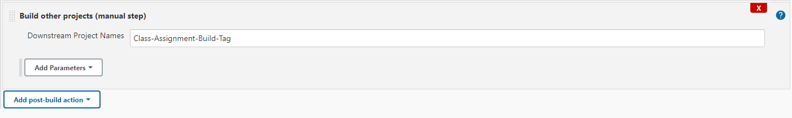

Para a pipeline sequencial, instalou-se o Promoted build plugin que permite aceitar manualmente e iniciar o próximo job.

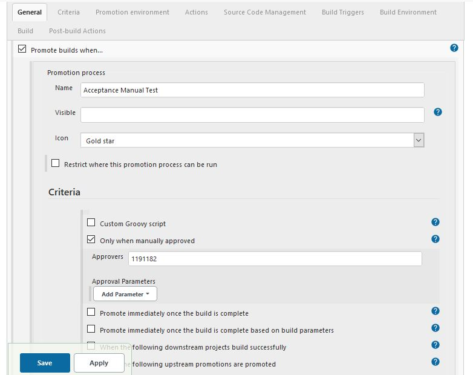
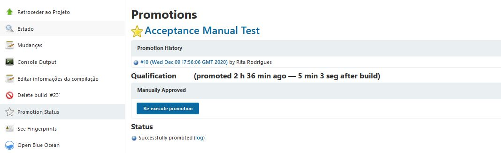

#### Envio da tag para um repositório

Por último, esta task é apenas executada se o utilizador assim o permitir e chama-se **Class-Assignment-Build-Tag** e **pipeline8**.

Aqui é utilizado o Git Plugin e é utilizada a post build action git publisher que permite fazer o push de uma tag para o repositório remoto, tal como demonstra a imagem.

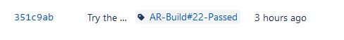

### Pipeline Sequencial utilizando Jenkins File
Nesta componente do projeto foi desenvolvida um pipeline utilizado o Jenkins File para fazer o Deploy da aplicação CMS Student

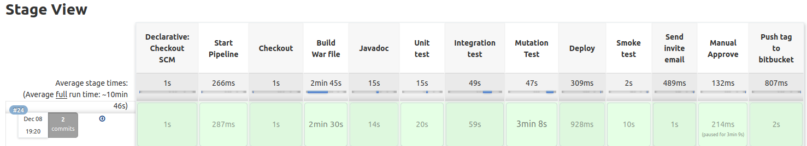

#### Configuração do script
Para facilitar a manutenção e leitura do script, foram criadas no inicio algumas variaveis com valores de configuração (paths, urls, branchs, ...)

#### Start Pipeline.
Este é um passo extra apenas para dar alguns detalhes sobre a execução que vai acontecer.

#### Checkout
Neste passo é feito o checkout da aplicação com recurso ao plugin de git do próprio Jenkins.

#### Build 
O build da aplicação foi feito utilizando as tasks do Gradle. No final deste passo é executado um comando ```archiveArtifacte``` para fazer o armazenamento do build para ser utilizado mais à frente.

#### Javadoc
Neste passo é gerado o javadoc da aplicação. Este processo utiliza a task ```javadoc``` do grade. No final do processo de gerar o javadoc, este é publicado utilizando o plugin instalado para o CA anterior.

#### Unit Test
Neste passo são executados os unit tests que foram escritos para aplicação com o auxilio do comando ```gradle test```. No final da execução o report gerado é publicado utilizando o plugin Jacoco, também utilizado no CA anterior.

#### Integration Test
Neste passo são executados os integration tests que foram escritos para aplicação com o auxilio do comando ```gradle integrationTest```. No final da execução o report gerado é publicado utilizando o plugin Jacoco, também utilizado no CA anterior.

#### Mutation Test
Para executar os mutation test é utilizada task ```pitest``` disponivel no gradle file. À semelhança dos testes anteriores, o resultado destes testes também é publicado utilizando um plugin, que neste caso é o PiTest.

#### Deploy
Neste passo o objetivo é tonar a aplicação disponivel através de um servidor tomcat. Inicialmente a abordagem escolhida foi tentar utilizar um plugin do Jenkins para fazer a cópia do ficheiro ```.war``` para o servidor, mas foram aparecendo alguns problemas no processo. Então optou-se por fazer uma cópia diretamente utilizando a própria shell do sistema. Assim exxecutou-se o comando 
```bash
cp <Localização do ficheiro .war no arquivo do Jenkins> <Pasta Webapps do Tomcat>
```
Todos os caminhos utilizados neste comando foram incluidos nas variaveis definidas no inicio do jenkins file.

>Como seria feito o deploy caso o Jenkins e o Tomcat não estivessem na mesma máquina?  
Neste caso a solução passaria por utilizar o comando ```scp``` para fazer a copia do ficheiro ```.war``` através de ```ssh```.

#### Smoke Test
O smoke test serve para verificar que a aplicação foi disponibilizada com sucesso. Antes de ser executado é feito um delay de 10 segundo para garantir que o servidor fez reload que teve tempo para disponibilizar a aplicação. De seguinda é executado o comando ```curl ``` para fazer um pedido à homepage da aplicação. Caso o comando retorne um 200 (referente ao código http que o servidor retorna no caso de encontrar o recurso pedido) o processo continua.

#### Send Invite email
Este é o momento que passa a ser necessária a intrevenção humana. Inicialmente é enviado um email a solicitar que o utilizador prossiga com o deploy. Neste email é incluido um link direto para o deploy 

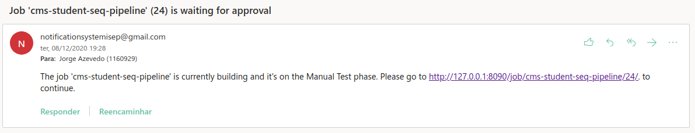

A configuração do envio do email teve de acontecer dentro das definições do Jenkins, em Configure System. Lá foi preenchida a secção "Extended E-mail Notification" com as configurações do servidor SMTP de onde o email é enviado.

#### Manual Approve
No manual approve é apenas pedido que o utilizador indique se pretende continuar ou abortar a execução da pipeline.

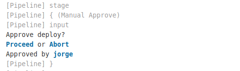

Caso o utilizador selecione "Proceed" a execução segue para o ultimo passo.

#### Push tag to bitbucket
No push da tag é simplesmente feito o push de uma tag ```ScriptedPipeline-Build-<Build Nr>``` para o repositório no Bitbucket

#### Página do Job no final da execução
No final da execução, se o utilizador for à pagina do job além do histórico das utiimas execuções, é ainda apresentado os relatórios execução dos testes, os relatórios de cobertura e um link para obter a versão mais recente do ficheiro ```.war```.

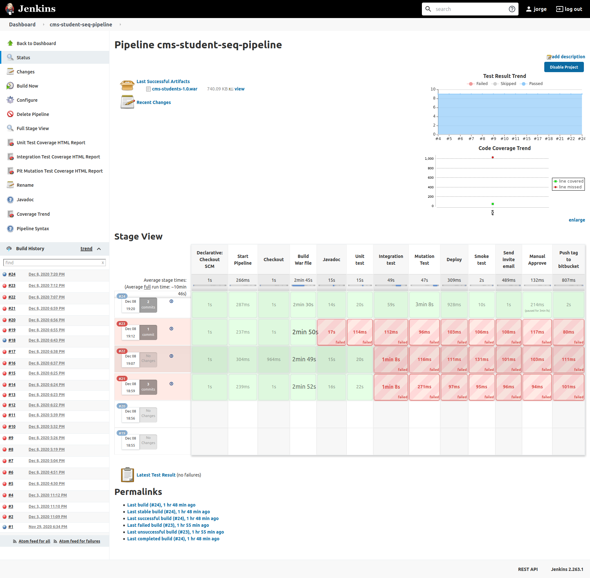

### Pipeline Paralela utilizando Jenkins File

## Conclusões

#### Grupo de trabalho:

Ana Rita Rodrigues 1191182, 
Nuno Dinis 1161042, 
Jorge Azevedo 1160929, 
João Santos 1150639.
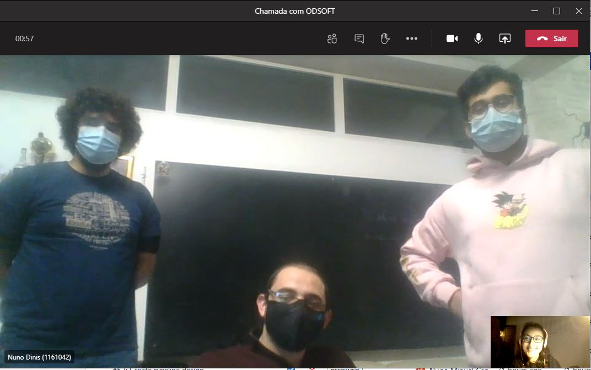
