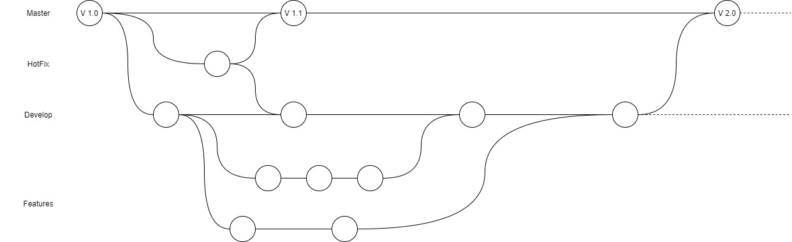
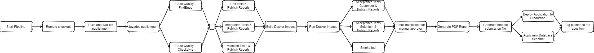

# ODSOFT - Projeto Final

# Análise do Enunciado

## 1 Contexto

### 1.1 Content Management System - Product Line

Sistema de informação de gestão

Um "Content Management System" (MIS) é um sistema de informação usado para a tomada de decisões e para a coordenação, controle, análise e visualização de informações em uma organização.

O estudo dos sistemas de informação gerencial envolve pessoas, processos e tecnologia em um contexto organizacional.

Em um ambiente corporativo, o objetivo final do uso de um sistema de informação gerencial é aumentar o valor e os lucros do negócio. Isso é feito fornecendo aos gerentes informações oportunas e adequadas, permitindo-lhes tomar decisões eficazes em um período de tempo mais curto.

Pipeline de implantação contínua!

### 1.2 Web Application Content Management System (CMS)

Em termos de recursos, este aplicativo deve permitir:

1. Gestão de armazéns, locais de envio, produtos e lotes;
2. Lote deve ter um ou mais Produtos; um Armazém pode conter um ou mais Lotes;
3. Armazéns podem conter um ou mais Locais de Remessa;
4. O mesmo Lote não pode ser alocado a dois Armazéns diferentes;
5. O mesmo Local de Remessa pode existir para dois Armazéns diferentes.

Atributos:

- Os armazéns são caracterizados pelo nome e capacidade;
- O local de envio é caracterizado pelo nome;
- O lote é caracterizado pelo nome, descrição e data de fabricação;
- O produto é caracterizado por nome, descrição e preço.

armazéns (nome, capacidade)
shipping_Location (nome)
lote (nome, descrição, data_de_manufatura)
produto (nome, descrição, preço)

## 2 Continuous Deployment Pipeline Concerns

O principal objetivo da atribuição para ODSOFT é implementar um pipeline de implantação contínua no Jenkins com pipelines declarativos.

O projeto deve incluir a concepção e implementação para o fornecimento de cinco questões principais da solução:

1.	Base Pipeline and Persistence.  	[All team members]	
2.	Documentation and Database. 		[@nunomcd]
3. Code Quality and Integration Tests. 	[@1191182]
4.	Functional and Smoke Testing.		[@Joao123]
5. Continuous Deployment.				[@1160929]
	
	
NOTA: 	Issues should be created on Bitbucket for each of these concerns. 
		The Jenkinsfile should be able to be executed either on Windows or Linux operating systems.
		
		
		
### 2.1 Base Pipeline and Persistence

	
	
- The overall pipeline should be designed. This includes a high-level design for all the concerns;
	
- The design should include a description of the process, include the Git organization (i.e., branching model) model to be adopted and how it relates to the pipeline;
	
- The application should be completed with the specifics features for the project;
	
- The application should have a persistence layer that uses a relational database. You may choose the technology to use for this non-functional requirement;
		
- Implement the pipeline for the specifics of this concern. The base pipeline implementation should include all the features addressed in Class Assignment - Part Two, using parallel stages when suitable;

- Classify your final project according to the CI/CD Maturity Model. You should specify which level was achieved for each topic.
	
	

### 2.2 Documentation and Database		
	
	

- The specific stages for this concern of the pipeline should be designed;	

- The application should have a persistence layer that must use a relational database. You may choose the technology to use for this non-functional requirement. The CMS should use an SGBD running on a different system than the CMS web application using containerisation (e.g. Docker images);
	
- Implement the pipeline for the specifics of this concern. The base pipeline implementation should include all the features addressed in Class Assignment - Part Two, using parallel stages when suitable.
		
- Generate the Project Report PDF file from your project’s Readme.md. You may choose the technology to use for this non-functional requirement;
	
- Generate and archive the project’s Moodle zip submission file, containing the Project Report PDF, the Jenkinsfile and the generated artefacts for the build (e.g. Javadoc, reports, etc. – excluding all temporary files);
	
- The CMS should be adapted to foreseen third-parties version releases. In this case, explicitly document and adapt the current CMS solution for supporting Gradle’s latest release (v. 6.7.1) and latest JDK release (v. 15.0.1).
		
		
		
### 2.3 Code Quality and Integration Tests		

- The specific stages for this concern of the pipeline should be designed;	
	
- The pipeline should include a “check” on the code quality of the project by using Checkstyle. Settings for code quality should be defined, including the thresholds for the build health. Analysis results must be published;
	
			Nota: 	Checkstyle -> https://checkstyle.sourceforge.io/index.html
	
- The pipeline should include a “check” on the code quality of the project by using FindBugs. Settings for code quality should be defined, including the thresholds for the build health. Analysis results must be published;
	
			Nota:	FindBugs -> http://findbugs.sourceforge.net/
	
- Integration tests should cover the specific features of the project. Testing and Coverage Reports should be published. Settings for integration test coverage should be defined, including the thresholds for the build health. The build should fail if coverage degrades more than the delta threshold that should be configured;
	
- Analysis results must be published and explicitly discussed in the project report;
	
- Implement the pipeline for the specifics of this concern. The base pipeline implementation should include all the features addressed in Class Assignment - Part Two, using parallel stages when suitable.
	
- Test the CMS application at least against two different Tomcat versions. There should be a configuration file in the repository stating which versions of the Tomcat must be used and running the tests against more than two different versions should be supported. For this requirement Tomcat can be running locally.
	
	

### 2.4 Functional and Smoke Testing
	
	
	
- The specific stages for this concern of the pipeline should be designed;
	
- Acceptance tests with Cucumber and Selenium should cover the specific features of the project. Cucumber Test and Coverage report should be published;
	
- These tests should be executed against an isolated staging environment (e.g docker container) with the application (do not forget that the application now has a database!).
	
- The image for this docker container should be published in the docker hub;
	
- The smoke test should be executed against the execution of the previously built docker container with the application running (do not forget that the application now has a database!);
	
- Implement the pipeline for the specifics of this concern. The base pipeline implementation should include all the features addressed in Class Assignment - Part Two, using parallel stages when suitable.
	
- Run the CMS’s acceptance tests using at least two different browsers. A configuration file in the repository should state which browsers and versions must be used to run the acceptance tests. More than two different browser/versions should be supported in the same build.
	
	
	
### 2.5 Continuous Deployment

	
- The specific stages for this concern of the pipeline should be designed;
	
- This should be the last stage of the pipeline. The idea is to simulate a live deployment to production;
	
- This should simulate the production stage using a docker container;
	
- It should be able to deploy the binaries/resources and also upgrade the database if necessary;
	
- It should be able to recover to the last “good” state if the upgrade fails;
	
- A tag should be created in the git repository related to the release and it also should be possible to identify this version from the deployed artefacts;
	
- Implement the pipeline for the specifics of this concern. The base pipeline implementation should include all the features addressed in Class Assignment - Part Two, using parallel stages when suitable.
	
- Perform a Blue/Green deployment of your application. For this task, the production environment should be running on at least three different machines i.e. the front-end tomcat proxy, the green production machine and the blue production machine (do not forget that the application now has a database that should also be running on a different machine!).

## 3 Termos e Condições

### 3.1 Apresentação do Projeto

O Relatório do Projeto representa 25% da pontuação do projeto e deve ser escrito usando a linguagem Markdown. Deve incluir:

• Os detalhes do design;
• Os detalhes técnicos da implementação;
• Uma análise das alternativas possíveis e a justificação das opções;

Os artefatos no repositório devem incluir o Jenkinsfile.

Será agendada sessão de apresentação / demonstração (D) do projeto. Isso representa 75% da pontuação do projeto.

### 3.2 Prazo

16 de janeiro de 2021 às 11h55

# Base Pipeline and Persistence

## Modelo de Git Branching
De forma a facilitar a organização no desenvolvimento do projeto o grupo definiu o seguinte modelo de *branching* que vai ser utilizado.
A branch **master** será a branch principal e aquela onde estará a versão mais estável do projeto. 
O desenvolvimento irá ocorrer na branch **develop**, sendo feitas derivações desta em branches **feature** que serão incluídas na branch develop assim que aquele desenvolvimento esteja concluído.
Na eventualidade de ser identificado um problema que requeira uma correção rápida da versão em produção (branch master) será feita uma derivação da branch desta versão para uma branch **hotfix**. Concluída a resolução do problema que motivou a correção, a mesma é enviada para as branches master e develop.

## Pipeline
### Esquema da Pipeline
Após a analise inicial, o grupo definiu o seguinte esboço para a pipeline CI/CD

No final do projeto, o aspeto da pipeline CI/CD é o seguinte
(Imagem da pipeline no fim)

### Separação dos ambientes de desenvolvimento e produção
Em ambientes corporativos onde existe o real objetivo de disponibilizar software para clientes finais existe de facto a necessidade de ter uma pipeline especifica para cada ambiente, no entanto o grupo entende que esse é um cenário demasiado complexo para o projeto a ser desenvolvido e por isso propõe a seguinte solução: O ficheiro jenkins fica na pasta cms-students (à semelhança do que acontece com os ficheiros equivalentes para o segundo class assignment). No servidor Jenkins existirão dois *jobs*, um para o ambiente de desenvolvimento e um para o ambiente de produção. Os *jobs* fazem checkout do *Jenkins File* da branch correspondente. Desta forma é garantido que o ficheiro que define os passos da pipeline está coerente com o código que está a ser trabalhado.

#### Adaptação da pipeline mediante as necessidades
O ficheiro Jenkins conta ainda ainda com a possibilidade de desativar a execução de alguns stages no ambiente de dev. Desta forma evita-se que passos mais demorados ocorram quando o objetivo da execução for testar outro algum passo.

## Organização das configurações das aplicações
De modo a manter uma total sintonia no grupo face às configurações das diferentes aplicações, o grupo decidiu criar um ficheiro de [configurações](./configurations.md) para manter uma lista atualizada de todas as configurações necessárias para executar o projeto, desde as configurações básicas do Jenkins até às portas onde as aplicações finais estarão à escuta aguardando pedidos.

## Persistência e novas funcionalidades
Foram adicionados novos componentes ao projeto cms, que permitem guardar produtos, batches e localizações de envio de um armazém. Para isto foram adicionados os elementos da user interface que permitem fazer atualização, criação, listagem bem como apagar entradas referentes a cada entidade.

Outra alteração foi a utilização de uma base de dados relacional ao invés da base de dados em memória previamente existente. O grupo decidiu utilizar mySql a implementar utilizando conteinerização. Para isto decidiram-se também os esquemas de cada entidade.

Para a interligação entre a base de dados e o resto da aplicação foi criada (reaptada) uma camada de persistência.

## Documentação e Base de Dados
Relativamente à base de dados o requisito foi cumprido através da utilização de uma base de dados, utilizando uma imagem docker MySql. Um ficheiro docker compose está responsável por subir e descer a base de dados.

### Adaptação do código

Após a criação desta base de dados, foi necessário adaptar o código existente para adicionar esta camada de persistência, trocando a anteriormente exsitente (com dummy data em memória). 

O código presente é consistente ao longo de todas as entidades existentes e baseia-se na utilização de uma classe que está responsável por fazer a conexão à Base de Dados (DBConnection) em que cada serviço vai utilizar essa conexão, com a utilização de drivers (JDBC) para aceder à pase de dados, através de prepared statements, nas classes de implementação de serviços de cada uma das entidades.

Para manter os dados já previamente guardados na base de dados, utilizaram-se volumes no docker compose, para permitir manter os dados já persistidos quando o container é descido.

### Documentação

Relativamente à documentação necessária, foi gerado um PDF num dos passos da pipeline, este PDF é gerado automáticamente a partir do ficheiro readme.me (um ficheiro markdown). Este passo da pipeline utiliza o pandoc, um conersor de documentos, que neste caso faz a conversão do ficheiro em Markdown para PDF. Para além desta instalação também é necessário a instalação do Latex (em que especificamente é utilizado o PDFLatex), uma vez que este é utilizado pelo pandoc para fazer a conversão do ficheiro.

O seguinte passo relativo a documentação é armazenamento e em um ficheiro ZIP dos reports de testes, ficheiro .war, entre outros artefactos gerados pelo jenkins ao longo da pipeline. Este passo é feito na mesma etapa de geração do ficheiro do PDF, em que todos estes ficheiros são copiados para um novo diretório, que é o dirtório que vai ser compactado originando o ficheiro ZIP suprarreferido.

### 

## Code Quality e Integration Tests

# 2.3 Code Quality and Integration Tests

### "CheckStyle" Plugin

O Checkstyle plugin realiza verificações de qualidade nos ficheiros de origem Java do projeto usando Checkstyle e gera relatórios dessas verificações.
Para este projeto, decidimos usar o plugin checkstyle das ferramentas "puppycrawl".
#### Como usar?
Para integrar este plugin no projeto GWT foi necessário introduzir no ficheiro build.gradle:

1. Introduzir o plugins do checkstyle ID 

   > id "checkstyle"
    
2. Adicionar a dependência do checkstyle na secção

   > compile 'com.puppycrawl.tools:checkstyle:8.27'
    
3. Adicionar umas configurações relativas ao checkstyle
     
   > checkstyle {
    
   >     configFile = rootProject.file('config/checkstyle/checkstyle.xml') //root do config file do checkstyle
        
   >     toolVersion = '8.27' //versão usada
        
   >     checkstyleTest.enabled = true // permite que faça análise às classes de teste
        
   >     showViolations = false //caso seja necessário mostrar validação, mudar para true
        
   >     sourceSets = [] // fonte se necessário
   > }
   
   > //executa o checkstyle nos arquivos de origem Java de produção
   
   > checkstyleMain {
   
   >     source ='src/main/java'
   
   > }
   
   > //executa o checkstyle nos arquivos de origem Java de teste
   
   > checkstyleTest {
   
   >     source ='src/test/java'
   
   > }

4. Adicionar a task do Checkstyle
   
   > tasks.withType(Checkstyle) {
    
   >     reports {
        
   >         xml.enabled true //permite gerar relatório xml
            
   >         html.enabled true //permite gerar relatório HTML
            
   >         html.stylesheet resources.text.fromFile('config/xsl/checkstyle-simple-check-style.xsl') //root do stylesheet do checkstyle
            
   >     }
        
   >     // retirado de https://bit.ly/34Hj1gT
        
   >     def maxWarnings = 7500 //máx de avisos que permite
        
   >     doLast {
        
   >         reports.all { report ->
            
   >             def outputFile = report.destination //destino do relatório
                
   >             //verificar numero de avisos ("erros")
                
   >             if (outputFile.exists()) {
                
   >                 def count = outputFile.text.count("<error ")
                    
   >                 if (count > maxWarnings) {
                    
   >                     throw new GradleException("[Threshold=$maxWarnings] There were $count checkstyle warnings! Check $outputFile")
                        
   >                 }
                    
   >             }
                
   >         }
            
   >     }
        
   > }
    

    
### "FindBugs" Plugin

O Findbugs plugin realiza também verificações de qualidade nos ficheiros de origem Java do projeto usando FindBugs e gera relatórios dessas verificações.
Para este projeto, decidimos usar o plugin checkstyle das ferramentas "puppycrawl".
#### Como usar?
Para integrar este plugin no projeto GWT foi necessário introduzir no ficheiro build.gradle:

1. Introduzir o plugins do findbugs ID 

   > id "findbugs"
    
2. Adicionar umas configurações relativas ao findbugs

   > findbugs {
    
   >     ignoreFailures = true // permite que a build continue se houver avisos
        
   >     toolVersion = '3.0.1' //versão usada
        
   >     excludeFilter = file("config/findbugs/excludeFilter.xml") //caminho do ficheiro que específica os bugs a serem excluídos do relatório
    
   >     effort = "max" //nível de esforço de análise. max->aumenta a precisão e encontra mais bugs, demorando mais tempo de execução e mais consumo de memória
        
   >     reportLevel  = "low" //específica o limite de confiança/prioridade para relatar problemas. low ->a confiança não é usada para filtrar bugs
        
   >     sourceSets = [] // fonte se necessário para a tarefa check e build
   
   > }

4. Adicionar a task do FindBugs

   > tasks.withType(FindBugs) {
    
   >     reports {
        
   >         xml.enabled false //permite gerar relatório xml se tiver true
            
   >         html.enabled true //permite gerar relatório HTML, apenas um (ou xml ou html) pode estar enabled pois entra em conflito
            
   >         html.stylesheet resources.text.fromFile('config/xsl/checkstyle-simple-find-bugs.xsl') //root do stylesheet do findbugs
            
   >     }
        
   > }

## Funtional e Smoke Tests
Texto Aqui

## Continuous Deployment
Texto Aqui

##
Maturity Model

1. Maturity Level: Build Management and Continuous Integration
Level:0

2. Maturity Level: Environments and Deployment
Level:-1

3. Maturity Level: Release Management and Compliance
Level:0

4. Maturity Level: Testing
Level:1

5. Maturity Level: Data Management
Level:1

6. Maturity Level: Configuration Management
Level:0